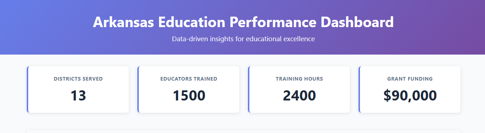
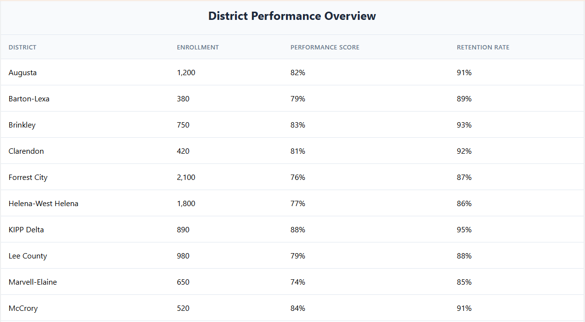
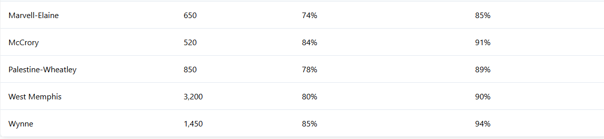
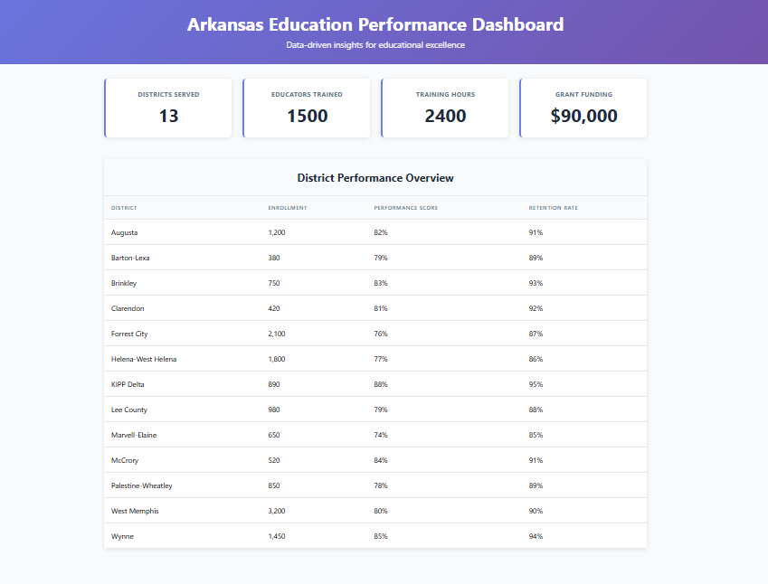

# Arkansas Education Performance Dashboard

A React TypeScript dashboard showcasing education data visualization and analysis capabilities from my tenure as Education Consultant at Arkansas Department of Education.

## Screenshots

### Dashboard Header


### District Performance Data




### Complete Overview


## Technologies Used
- React with TypeScript
- CSS Grid and Flexbox
- Data visualization
- Responsive design

## District Coverage
This dashboard displays metrics for 13 Arkansas school districts: Palestine-Wheatley, Augusta, Forrest City, Marvell-Elaine, Lee County, Helena-West Helena, Clarendon, West Memphis, Brinkley, KIPP Delta, Wynne, Barton-Lexa, and McCrory.

## Installation
```bash
npm install --legacy-peer-deps
npm start
